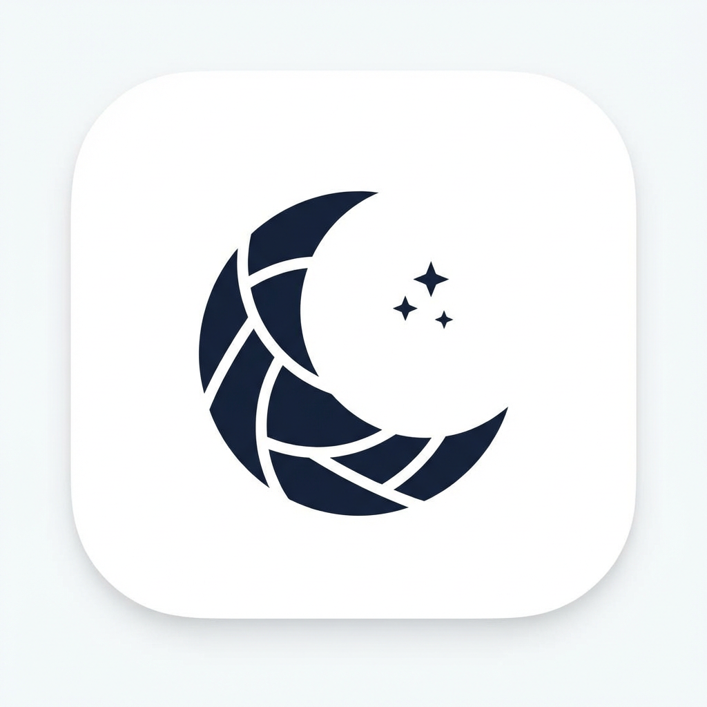

<p align="center">
  
</p>

<h1 align="center">Night Shift</h1>

<p align="center">A simple tool to toggle macOS Night Shift — from the menu bar or the command line.</p>

## Installation & Build

This tool uses the private `CoreBrightness` framework found on macOS. To build it, compile the Objective-C source file:

```bash
clang -framework Foundation -framework Cocoa -o nightshift nightshift.m
```

Or download a pre-built binary from the [Releases](https://github.com/shonenada-vibe/night-shift/releases) page.

## Usage

### Menu Bar App (default)

Run without arguments to launch the menu bar app:

```bash
./nightshift
```

A 🌙 (enabled) or ☀️ (disabled) icon appears in the menu bar. Click it to toggle Night Shift or quit.

### CLI Mode

Pass `on` or `off` to toggle directly from the terminal:

```bash
./nightshift on
./nightshift off
```

## Disclaimer

This tool uses a private API (`CoreBrightness.framework`), which is not documented by Apple. It may stop working in future macOS updates.
